# Web Security: Common Vulnerability and Prevention

## Thành viên

- 19120219 Hà Chí Hào
- 19120384 Nguyễn Trung Thời
- 19120476 Trần Phương Đình

## Mục lục

- [Mục lục](#mục-lục)
  - [Giới thiệu](#giới-thiệu)
  - [XSS attack](#xss-attack)
    - [**_Giới thiệu XSS attack_**](#giới-thiệu-xss-attack)
    - [**_Phân loại và phương thức_**](#phân-loại-và-phương-thức)
      - [**Stored Cross-Site Scripting Attacks**](#stored-cross-site-scripting-attacks)
      - [**Reflected Cross-Site Scripting Attacks**](#reflected-cross-site-scripting-attacks)
      - [**DOM-Based Cross-Site Scripting Attacks**](#dom-based-cross-site-scripting-attacks)
    - [**_Phòng chống_**](#phòng-chống)
      - [**Escape dynamic content**](#escape-dynamic-content)
      - [**Content Security Policy**](#content-security-policy)
    - [**_So sánh_**](#so-sánh)
    - [**_DEMO_**](#demo)
  - [**CSRF Attack**](#csrf-attack)
    - [**Khái niệm CSRF Attack**](#khái-niệm-csrf-attack)
    - [**Mục đích CSRF Attack**](#mục-đích-csrf-attack)
    - [**Phương thức và phòng chống CSRF Attack**](#phương-thức-và-phòng-chống-csrf-attack)
      - [**_Phương thức_**](#phương-thức)
      - [**_Cách phòng chống_**](#cách-phòng-chống)
    - [**CSRF hiện nay**](#csrf-hiện-nay)
  - [SQL Injection](#sql-injection)
    - [**Khái niệm**](#khái-niệm)
      - [**_Injection Attack_**](#injection-attack)
      - [**_SQL Injection_**](#sql-injection-1)
      - [**_Một số cuộc tấn công_**](#một-số-cuộc-tấn-công)
    - [**Mục đích**](#mục-đích)
    - [**Phương thức và phòng chống SQL Injection**](#phương-thức-và-phòng-chống-sql-injection)
      - [**_Phương thức_**](#phương-thức-1)
      - [**_Demo_**](#demo)
      - [**_Phòng chống_**](#phòng-chống-1)
  - [Clickjacking](#clickjacking)
    - [**_Khái niệm Clickjacking_**](#khái-niệm-clickjacking)
    - [**_Phương pháp_**](#phương-pháp)
    - [**_Phòng chống Clickjacking_**](#phòng-chống-clickjacking)
      - [**Frame busting**](#frame-busting)
      - [**X-Frame-Options**](#x-frame-options)
      - [**Phòng chống Clickjacking với Content Security Policy**](#phòng-chống-clickjacking-với-content-security-policy)
  - [References](#references)

## Giới thiệu

Web Security luôn là vấn đề đau đầu của các quản trị viên website. Các lỗ hổng bảo mật cho phép tin tặc khai thác – tấn công – xâm nhập – vi phạm dữ liệu của website doanh nghiệp. Do đó, việc hiểu biết và ngăn chặn các lỗ hổng bảo mật website là một trong những công việc quan trọng để xây dựng một trang web an toàn và hoàn thiện.

OWASP là một tiêu chuẩn toàn cầu để phục vụ việc kiểm thử xâm nhập – Penetration Testing (Pentest) được dễ dàng hơn. Tiêu chuẩn này được đề xuất bởi một tổ chức phi lợi nhuận: Open Web Application Security Project (OWASP). Tiêu chuẩn OWASP giúp cho các chuyên gia kiểm thử (pentester) kiểm tra bảo mật cho website một cách chi tiết, hiệu quả. Hằng năm, OWASP đều công bố top 10 lỗ hổng bảo mật phổ biến mà các trang web lớn nhỏ đều mắc phải. Sau đây, chúng tôi sẽ giới thiệu một vài lỗ hổng bảo mật mà các trang web thường mắc phải cũng như cách để ngăn chặn chúng.

## XSS attack

### **_Giới thiệu XSS attack_**

Bình thường, các backend developer sẽ cố hết sức làm sao cho server của họ được an toàn và có độ bảo mật cao nhất có thể để tránh việc server bị hacker làm sập. Nhưng thua keo này ta bày keo khác, hacker thay vì nhắm tới server, thì họ sẽ quay sang nhắm tới browser của người dùng. Browser sẽ thực hiện mọi lệnh javascript mà nó có thể tìm thấy một cách không cảnh giác. Chính vì vậy, hacker có thể inject javascript code vào browser và chúng sẽ được thực hiện khi người dùng xem website, từ đó hacker có thể làm rất nhiều thứ bằng javascript trên browser của user, từ việc lấy cắp thông tin khi user nhập thông tin của họ, hay làm cho browser thực hiện một việc ngoài ý muốn của user (chẳng hạn như bình luận khắp mọi nơi mà user không hề biết). Việc inject javascript vào browser như vậy được gọi là Cross-site scripting (XSS) attack.

### **_Phân loại và phương thức_**

#### **Stored Cross-Site Scripting Attacks**

Stored Cross-Site Scripting Attacks là một cách tấn công XSS mà kẻ tấn công sẽ inject javascript vào database (bằng cách để code javascript trong tag `<script>`), thông qua các input thông thường mà website cho phép nhập như bình luận, chỉnh sửa thông tin tài khoản,... Không phải để làm hại tới database, mà để cho trình duyệt thực hiện những dòng javascript đó mỗi lần website được truy cập.
Ví dụ với một website cho người dùng thích làm bánh tên là Breddit, website cho phép người dùng tạo bài đăng và bình luận, và bài đăng, bình luận nào cũng sẽ được lưu vào database để hiện ra cho người khác khi họ xem website.

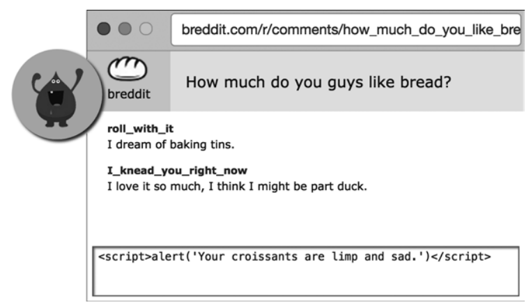

Nếu như người làm ra website không hề cài đặt biện pháp phòng chống XSS nào, thì một kẻ tấn công có thể tạo một bình luận chứa mã javascript, thì từ đó những người nào truy cập website mà thấy bình luận đó thì mã javascript trong đấy cũng sẽ được thực hiện.

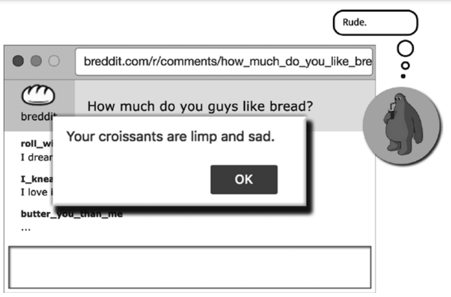

Đây chỉ là một lệnh alert vô hại, chỉ gây phiền toái cho những user khác. Nhưng đây cũng là cách mà hacker biết rằng một website có thực hiện XSS được hay không, và thế là từ đó hành động của họ sẽ nguy hiểm hơn.

#### **Reflected Cross-Site Scripting Attacks**

Thay vì inject javascript vào database để chúng được thực hiện mỗi lần 1 browser truy cập website, thì hacker còn có thể inject javascript vào trong HTTP Request. Vì nếu như website bị tấn công có lấy một phần trong HTTP Request để show nó trong trang web (thường là query tìm kiếm trong URL) thì đoạn javascript của hacker hoàn toàn có thể được browser thực hiện và thực hiện các mục đích nguy hiểm, đó gọi là Reflected Cross-Site Scripting Attacks, vì server đã reflect (phản chiếu) lại những gì hacker gửi.

Ví dụ một website có cho người dùng tìm kiếm đồ uống bằng url có query như sau:
<https://mywebsite.com/search?product=coffee>
Và website sẽ hiển thị lại thông báo kết quả cho người dùng như sau trong HTML:\
`<p>Kết quả tìm kiếm cho coffee</p>`

Giả sử người làm ra website này không có biện pháp phòng chống nào cho reflected XSS, thì kẻ tấn công có thể nhập url như sau:\
`https://mywebsite.com/search?product>=<script>alert("hehe");</script>`

Và website sẽ hiển thị trong HTML:\
`<p>Kết quả tìm kiếm cho <script>alert("hehe");</script></p>`

Như vậy, ta thấy là hacker cũng có thể inject javascript vào HTTP Request, cụ thể trong trường hợp này là URL trong HTTP Request, để browser thực hiện các lệnh javascript ấy nhằm các mục đích nguy hiểm. Tuy nhiên để dạng tấn công này được hiệu quả thì hacker phải lừa được người dùng khác nhấn vào URL mà hacker đã xây dựng, thì cuộc tấn công mới được thực hiện.

#### **DOM-Based Cross-Site Scripting Attacks**

Hai cách tấn công trên đều có thông qua server (lưu vào database, hiển thị 1 phần nội dung trong HTTP request) mới có khả năng thực hiện được. Nhưng vì sự phát triển của các framework ở client hiện nay nên tấn công XSS có thể không cần thông qua server mà chỉ cần lợi dụng lỗ hổng ở phía client, cụ thể là các lỗ hổng ở các Document Object Model (DOM) của javascript. Sự lợi dụng này được gọi là DOM-based Cross-site scripting attack.

Cụ thể, khi DOM-based XSS xảy ra, thì một tập dữ liệu có mã độc chảy từ một source sang 1 sink, trong đó source là nơi mà người dùng có thể nhập data vào, thường là URL, và sink là một lời gọi các hàm nguy hiểm ,các hàm nguy hiểm đó là:

```javascript
document.write();
document.writeln();
document.domain;
element.innerHTML;
element.outerHTML;
element.insertAdjacentHTML;
element.onevent;
```

Nhưng tuỳ vào sink và cách website sử dụng chúng, kẻ tấn công phải suy nghĩ cách để inject được mã độc vào browser. Ví dụ như khi website sử dụng document.write() mà data mà kẻ tấn công đang nhắm tới được để trong cặp dấu ngoặc kép, thì kẻ tấn công phải thêm "> trước khi họ ghi `<script>` để đóng cặp ngoặc và element đó. Hoặc đối với innerHTML, thì tag `<script>` sẽ không được chạy, cho nên kẻ tấn công sẽ phải dùng các tag khác như img hay iframe để thực hiện XSS attack. Ví dụ:\
`element.innerHTML='...  ...'`

Một trong những cách lợi dụng phổ biến là nhắm vào URI Fragment của URL làm source. URI fragment chính là phần phía sau dấu "#" của URL, để scroll tới element có id đó khi web page được load. Các Single-page app (SPA), vì muốn tránh việc browser bị nháy trắng mỗi khi refresh page, nên họ để cả app vào trong 1 static URL và dùng URI Fragment để nhớ trạng thái lúc trước (vị trí) và load lại trạng thái đó mà không bị nháy. Kỹ thuật này cũng được sử dụng vào các ứng dụng web có infinite-scrolling.

Bình thường thì URI fragment sẽ không được gửi cho server, cho nên ta không thể bảo vệ DOM-based XSS bằng cách tăng cường bảo mật trên code của phía server, ngoài ra thì các developer cũng sẽ không thể nhìn server log để dò tìm thấy dấu vết cuộc tấn công nào, cho nên ta luôn cần phải xem xét kỹ lưỡng code bên phía client.

Theo lẽ thường thì fragment thường sẽ không được ghi ra thẳng nội dung của website, nhưng nó sẽ được ghi nếu developer bất cẩn không phân biệt giữa query và fragment và thế là fragment sẽ được ghi ra nội dung của website:

```html
<p id="a">
    <script>
        queryPosition = document.location.href.indexOf("product=");
        if (queryPosition >= 0) {
            var paramValue = decodeURIComponent(
                document.location.href.substring(queryPosition + 8)
            );
            document.write(`Result:  ${decodeURIComponent(paramValue)}`);
        }
    </script>
</p>
```

Như vậy:
`https://mywebsite.com/search?product=<script>alert("hehe");</script>`

Hoặc:
`https://mywebsite.com/search#product=<script>alert("hehe");</script>`

Đều có thể làm hiện alert, nhưng hacker nếu được thì họ sẽ dùng cái bên dưới vì URI Fragment sẽ không được gửi lên cho server và được ghi vào log, làm cho các developer của website rất khó nhận ra lỗ hổng.

### **_Phòng chống_**

#### **Escape dynamic content**

Cách đơn giản nhất để tránh browser thực hiện những đoạn javascript không mong muốn, chính là không xem những nội dung lấy từ database, HTTP request, fragment hay nhiều nguồn khác (dynamic content) là những đoạn HTML. Cách để làm được điều này đó chính là ta sẽ escape những kí tự điều khiển của HTML thành những entity encoding để cho chúng không có ý nghĩa gì đối với HTML mà chỉ là nội dung bình thường. Cách này có thể dùng đổi phòng chống cả 3 loại XSS.
Bảng các entity encoding ứng với các kí tự điều khiển của HTML:\
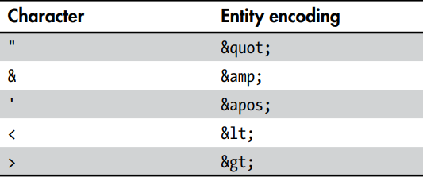

Cách escape dynamic content tuỳ thuộc vào công nghệ mà server sử dụng:

- Python (Django): `**{{ "{{ contents " }}}}**`
- Ruby (Rails): `<%= contents %>`
- Java (Java server pages): `<c:out value="${contents}">`
- C# (ASP.NET): `<%= HttpUtility.HtmlEncode(contents) %>`
- Node:
  - Mustache: `{{ "{{ contents " }}}}`
  - Dust: `{ contents }`
  - Nunjucks: `{{ "{{ contents " }}}}`
- AngularJS: `<div>{{dynamicContent}}</div>`
- React: `<div>{dynamicContent}</div>`

Ví dụ với reflected XSS:\
`https://mywebsite.com/search?product=<script>alert("hehe");</script>`

Thì nó sẽ ra:\
`<p>Kết quả tìm kiếm cho &lt;script&gt;alert(&quot;hehe&quot;)&lt;/script&gt;</p>`

Như vậy cuộc tấn công này đã bị vô hiệu hoá.

Vì XSS đã trở nên khá phổ biến nên các framework hiện đại đều đã có escape dynamic content một cách tự động.

#### **Content Security Policy**

Một cách khác để chống việc browser thực hiện những javascript được inject vào qua các loại XSS kể trên, đó là "nói" với browser của user rằng không nên thực hiện những dòng javascript ở các nguồn nào, cách để ta "nói" cho browser biết đó chính là sử dụng Content Security Policy (CSP)

Đối với XSS, thì kẻ tấn công chỉ có thể inject inline javascript, là những đoạn javascript mà được ghi thẳng giữa tag `<script>`, và tag `<script>` nhưng có thuộc tính src để dẫn đến file javascript ở chỗ khác. Hai điều này có thể tránh được bằng cách "nói" với browser là đừng chạy inline javascript và file javascript có nguồn ở bên ngoài. Ta có thể "nói" được điều đó với policy như sau:\
`Content-Security-Policy: script-src 'self'`

CSP có thể được đặt ở HTTP headers, hoặc ta có thể trong tag meta của file HTML như sau:\
`<meta http-equiv="Content-Security-Policy" content="script-src 'self'">`

Ngoài việc dùng để chặn việc chạy các đoạn javascript, thì người ta còn hay dùng CSP để tạo violation reports, để báo cho server biết và lưu lại vào log. Một lúc nào đó team developer sẽ mở log đó ra xem và tìm những page nào có lỗ hổng, thì họ sẽ vá cùng 1 lúc để không phải quá dựa dẫm vào CSP. Chúng ta có thể làm điều này bằng policy:\
`Content-Security-Policy-Report-Only: script-src 'self'; report-uri https://example.com/csr-reports`

Content security policy có thể dùng để chống cả 3 loại XSS, ngoài ra nó còn có thể chống được nhiều loại tấn công khác.

### **_So sánh_**

Độ nguy hiểm của cả 3 loại XSS đều như nhau vì nó tùy thuộc vào những gì mà kẻ tấn công để vào đoạn javascript được inject vào browser.

| Stored                                                                                  | Reflected                                                                                   | DOM-based                                                                           |
| --------------------------------------------------------------------------------------- | ------------------------------------------------------------------------------------------- | ----------------------------------------------------------------------------------- |
| Inject javascript vào csdl -> có giao tiếp với server -> xuất hiện trong server log     | Inject javascript vào HTTP request -> có giao tiếp với server -> xuất hiện trong server log | Không giao tiếp với server -> Không xuất hiện trong server log -> khó phát hiện hơn |
| Lưu vào database -> Mọi user truy cập đều trở thành nạn nhân -> Khả năng dẫn truyền cao | Phải lừa được người khác bấm vào URL được xây dựng -> khả năng dẫn truyền thấp              | Phải lừa được người khác bấm vào URL được xây dựng -> khả năng dẫn truyền thấp      |

### **_DEMO_**

Em đã tạo sẵn 1 ứng dụng web đơn giản và README hướng dẫn được viết bằng tiếng anh ở [đây](https://github.com/hachihao792001/DemoStoredXSS), để tiện demo về Stored XSS, cũng như là cách phòng chống nó.

## **CSRF Attack**

### **Khái niệm CSRF Attack**

CSRF ( Cross Site Request Forgery) là kỹ thuật tấn công bằng cách sử dụng quyền chứng thực của người dùng đối với một website. CSRF là kỹ thuật tấn công vào người dùng, dựa vào đó hacker có thể thực thi những thao tác phải yêu cầu sự chứng thực. Nói cho dễ hiểu, khi bạn truy cập 1 trang web của Attacker, Attacker tự động tạo 1 request đến trang target mà tất cả các cookie được lưu trong trình duyệt của người dùng với trang target sẽ được tự động thêm vào. Nói cách khác, 1 phiên làm việc thuộc 1 trang lại có thể được sử dụng bởi trang khác. Đây chính là mấu chốt của việc tấn công CSRF.

### **Mục đích CSRF Attack**

Lợi dụng lỗ hổng thông qua CSRF, các hacker có thể lợi dụng để:

- Đánh cắp đi những dữ liệu bí mật.
- Thực hiện phát tán worm lên mạng xã hội.
- Cài đặt những phần mềm độc hại lên điện thoại di động.
- Thực hiện khảo sát trực tuyến.

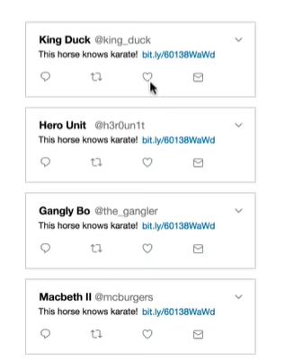

### **Phương thức và phòng chống CSRF Attack**

#### **_Phương thức_**

Các ứng dụng web hoạt động theo cơ chế nhận các câu lệnh HTTP từ người sử dụng, sau đó thực thi các câu lệnh này. Hacker sử dụng phương pháp CSRF để lừa trình duyệt của người dùng gửi đi các câu lệnh http đến các ứng dụng web. Điều đó có thể thực hiện bằng cách chèn mã độc hay link đến trang web mà người dùng đã được chứng thực. Trong trường hợp phiên làm việc của người dùng chưa hết hiệu lực thì các câu lệnh trên sẽ được thực hiện với quyền chứng thực của người sử dụng.

Ví dụ để hiểu rõ hơn, khi ứng dụng web có một chức năng đơn giản đó là thay đổi mật khẩu người dùng. Việc gửi lên server theo phương thức HTTP GET thông thường. Nội dung gửi lên là password mới và confirm lại password vừa nhập:

1. Người dùng đã đăng nhập trên web của bạn, cookie sẽ được tạo và lưu trữ dưới trình duyệt, khi bạn vào site lần sau bạn không cần phải đăng nhập lại. Giả sử bạn chưa đăng thoát, lúc này cookies của bạn vẫn còn hạn trong phiên làm việc.\
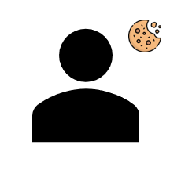

2. Lúc này nếu website của bạn mắc lỗi CSRF, người dùng vô tình vào một trang hacker giả mạo với mục đích lấy tài khoản từ ứng dụng web của bạn. Trong trang giả mạo hacker sẽ chạy một url để cố ý reset mật khẩu người dùng trên trang của bạn:
   <https://website_cua_ban.com/accounts/?passwordnew=hacked&passwordconf=hacked&Change=Change>#\
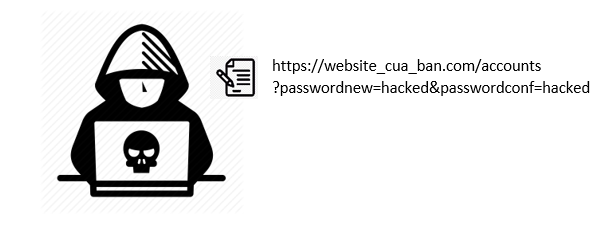

3. Khi đó, ứng dụng web website_cua_ban.com sẽ nhận request và có chứng thực là người dùng hiện tại và thực hiện reset mật khẩu. Và nếu biết được username, hacker có thể dễ dàng lấy được quyền truy cập tài khoản của bạn.\
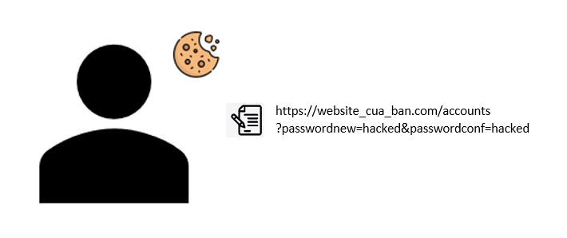

#### **_Cách phòng chống_**

Đối với từng đối tượng, chúng ta sẽ có các cách phòng chống khác nhau:

##### **1. User**

- Nên đăng xuất khỏi các website quan trọng: Tài khoản ngân hàng, thanh toán trực tuyến, các mạng xã hội, gmail… khi đã thực hiện xong giao dịch.
- Nên login vào một máy riêng và không cho người thứ 2 tiếp xúc với máy đó.
- Không nên click vào các đường dẫn mà bạn nhận được qua email, qua facebook … Khi bạn đưa chuột qua 1 đường dẫn, phía dưới bên trái của trình duyệt thường có địa chỉ website đích, bạn nên lưu ý để đến đúng trang mình muốn.
- Không lưu các thông tin về mật khẩu tại trình duyệt của mình. Không nên chọn các phương thức "đăng nhập lần sau", "lưu mật khẩu" …
- Trong quá trình thực hiện giao dịch hay vào các website quan trọng không nên vào các website khác, có thể chứa các mã khai thác của kẻ tấn công.

##### **2. Server**

- **Sử dụng captcha, các thông báo xác nhận:** Captcha được sử dụng để nhận biết đối tượng đang thao tác với hệ thống là con người hay không. Các thao tác quan trọng như "đăng nhập" hay là "chuyển khoản" ,"thanh toán" thường là hay sử dụng captcha. Những chức năng quan trọng như reset mật khẩu, xác nhận thay đổi info của account cũng nên gửi url qua email đã đăng ký để người dùng có thể click vào xác nhận.

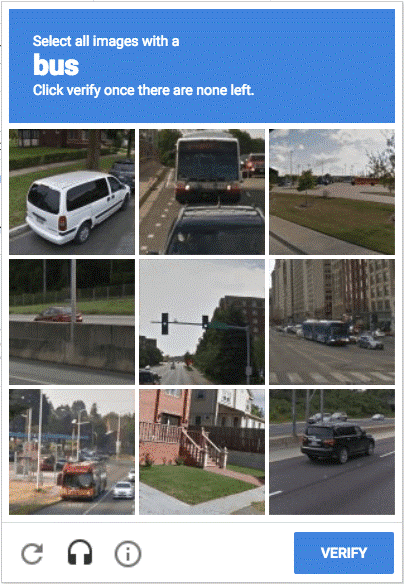

- **Sử dụng Token:** Các ứng dụng web nên nhúng một secret token. Các requests được thực hiện từ trang web này nên mang theo token đó, nếu không có sẽ được xem là cross-site request và sẽ không được thực thi đúng như mong muốn. Token này được tạo ra là duy nhất và khác nhau với mỗi phiên làm việc. Hàm tạo ra thường nhận đối số là SESSION hoặc TIME_STAMP. Phía Server khi nhận sẽ đối chiếu Token và quyết định có thực hiện hay không. (Ví dụ, JSW Token)

- **Sử dụng Samesite Cookie:** Có 1 thuộc tính cookie mới, Chrome đã bắt đầu hỗ trợ vào ngày 29 tháng 3 và theo sau là các trình duyệt phổ biến khác. Đó được gọi là thuộc tính Cookie Same-Site. Các đội developer có thể chỉ dẫn cho trình duyệt kiểm soát xem cookie có được gửi cùng với request của trang web bên thứ 3 tạo ra hay không, bằng cách sử dụng thuộc tính cookie Same-Site. Đây là một giải pháp thiết thực hơn so với việc từ chối gửi cookie.

Đặt thuộc tính Same-Site khá đơn giản, nó chỉ cần thêm giá trị SameSite vào cookie, ví dụ:

```javascript
  Set-Cookie: CookieName=CookieValue; SameSite=Lax;
  Set-Cookie: CookieName=CookieValue; SameSite=Strict;
```

| SameSite=Strict                                                                                                                                                                                                                                                                                                                                                     | SameSite=Lax                                                                                                                                                                                                                                                                                                                        | SameSite=None                                                                                                                                                                                                                       |
| ------------------------------------------------------------------------------------------------------------------------------------------------------------------------------------------------------------------------------------------------------------------------------------------------------------------------------------------------------------------- | ----------------------------------------------------------------------------------------------------------------------------------------------------------------------------------------------------------------------------------------------------------------------------------------------------------------------------------- | ----------------------------------------------------------------------------------------------------------------------------------------------------------------------------------------------------------------------------------- |
| Như cái tên đã cho thấy rằng, đây là tùy chọn trong đó quy định Same-Site được áp dụng nghiêm ngặt. Khi thuộc tính SameSite được đặt là Strict, cookie sẽ không được gửi cùng với các request được bắt đầu bởi các trang web của bên thứ 3.                                                                                                                         | Để tăng sự tiện dụng nhưng vẫn duy trì tính an toàn nhất định, hãy đặt SameSite = Lax. Với cài đặt này, trình duyệt sẽ cho phép chia sẻ cookie giữa các trang web có cùng tên miền bắt chéo với nhau bắt nguồn từ yêu cầu GET cấp cao nhất. Do phương thức POST là kiểu HTTP "không an toàn" nên Cookie k được gửi khi SameSite=Lax | Việc sử dụng Cookie sẽ bình thường như trước đây khi có thể chia sẻ thông tin giữa bất cứ trang web nào với nhau. Với thiết lập này, rất thận trọng xem xét thông tin gì thì lưu ở Cookie và thông tin nào không.                   |
| Đặt cookie là Strict có thể ảnh hưởng tiêu cực đến trải nghiệm duyệt web. Ví dụ: nếu bạn nhấp vào 1 liên kết dẫn đến trang profile của Facebook, và Facebook.com đặt cookie của nó là SameSite=Strict thì bạn không thể tiếp tục redirect trên Facebook trừ khi bạn đăng nhập lại vào Facebook. Lý do là vì Cookie của Facebook không được gửi kèm với request này. | Như vậy 2 trang web có thể chia sẻ dữ liệu cookie cho nhau miễn nó thuộc cùng một miền chéo, ví dụ hai web có cùng domain chính với nhau.                                                                                                                                                                                           | Người dùng sẽ có nhiều thuận lợi khi nhờ thông tin cá nhân được lưu trữ mà các trang web sẽ tối ưu để cá nhân hóa theo trải nghiệm của riêng họ. Đánh đổi lại là nguy cơ bảo mật bị các trang web lừa đảo ăn cắp thông tin cá nhân. |

### **CSRF hiện nay**

- Có vẻ như thuộc tính cookie SameSite là một biện pháp bảo mật hiệu quả chống lại các cuộc tấn công CSRF.
- Sự phổ biến của CSRF đang đi xuống, chứng minh cho điều này thì CSRF đang ở vị trí thứ 5 danh sách Top 10 của OWASP được công bố vào năm 2010, nhưng nó lại xuống vị trí thứ 8 vào năm 2013. Và bây giờ chúng ta k thấy nó xuất hiện trong danh sách Top 10 của OWASP nữa.
- Trình duyệt phổ biến nhất hiện nay là Google Chrome cũng đã có cập nhật về SameSite, cùng với Firefox ở phiên bản FireFox69 và các browser khác.
- Vì vậy, ngày nay, tấn công CSRF đã gần như biến mất.

## SQL Injection

### **Khái niệm**

#### **_Injection Attack_**

Là một hình thức tấn công bảo mật mà hacker có thể chèn vào một đoạn code vào mã nguồn của chương trình và thay đổi kết quả thực thi.

#### **_SQL Injection_**

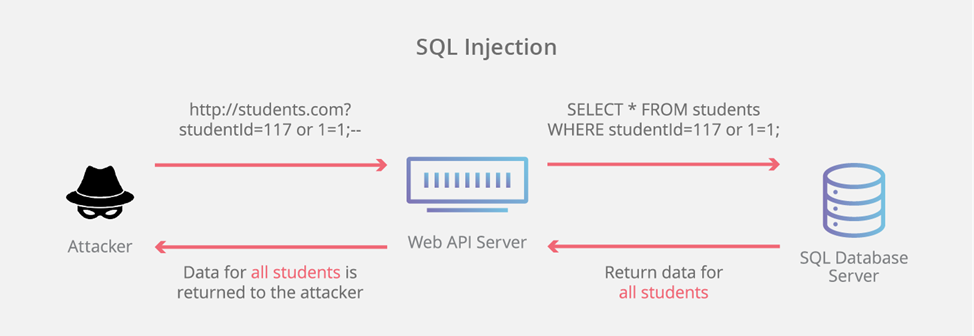
SQL Injection là một kỹ thuật lợi dụng những lỗ hổng về câu truy vấn của các ứng dụng. Được thực hiện bằng cách chèn thêm một đoạn SQL để làm sai lệnh đi câu truy vấn ban đầu, từ đó có thể khai thác dữ liệu từ database. SQL injection có thể cho phép những kẻ tấn công thực hiện các thao tác như một người quản trị web, trên cơ sở dữ liệu của ứng dụng.

Hacker có thể dùng các lệnh SQL để đánh cắp hoặc phá hoại dữ liệu của database, gây tổn thất đến người dùng và hệ thống.

#### **_Một số cuộc tấn công_**

- Nhiều cơ quan, trường học của Mỹ bị tấn công bởi lỗ hổng SQL Injection: <https://vtv.vn/cong-nghe/diem-mat-nhung-vu-tan-cong-mang-am-i-nhat-gan-day-20180923215527881.htm>
    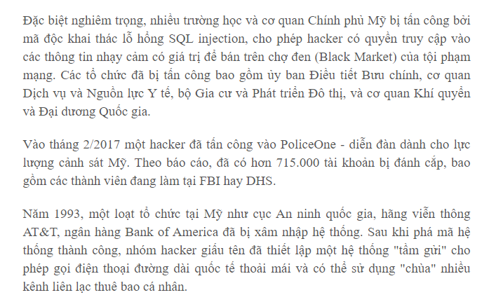
- BKAV cũng bị tấn công bởi lỗ hổng SQL Injection: <https://vnexpress.net/hacker-da-tan-cong-bkav-tu-mot-loi-co-ban-4341131.html>
    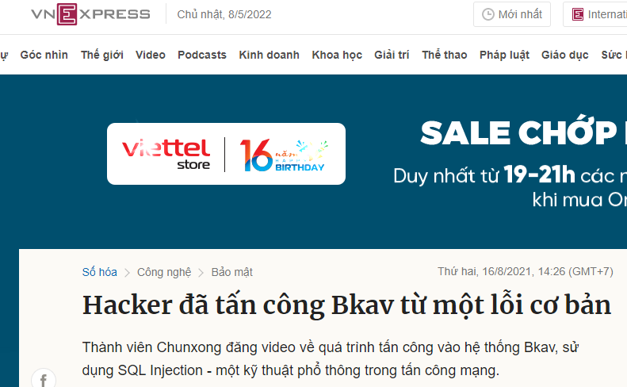

### **Mục đích**

- Hack tài khoản cá nhân.
- Ăn cắp hoặc sao chép dữ liệu của trang web hoặc hệ thống.
- Thay đổi dữ liệu nhạy cảm của hệ thống.
- Xóa dữ liệu nhạy cảm và quan trọng của hệ thống.
- Người dùng có thể đăng nhập vào ứng dụng với tư cách người dùng khác, ngay cả với tư cách quản trị viên.
- Người dùng có thể xem thông tin cá nhân thuộc về những người dùng khác, ví dụ chi tiết hồ sơ của người dùng khác, chi tiết giao dịch của họ,…
- Người dùng có thể sửa đổi cấu trúc của cơ sở dữ liệu, thậm chí xóa các bảng trong cơ sở dữ liệu ứng dụng.
- Người dùng có thể kiểm soát máy chủ cơ sở dữ liệu và thực thi lệnh theo ý muốn.

### **Phương thức và phòng chống SQL Injection**

#### **_Phương thức SQL Injection_**

Hacker có thể kiểm tra lỗ hổng này rất dễ dàng. Chỉ cần nhập ký hiệu ' hoặc " vào các trường được kiểm tra (ví dụ như form đăng nhập, đăng kí, URL của website,...). Nếu nó trả về bất kỳ thông báo bất ngờ hoặc bất thường, thì hacker có thể nhan dinh rằng SQL Injection khả thi cho trường đó.

#### **_Demo_**

Được thực hiện trang trang: <https://www.hacksplaining.com/exercises/sql-injection>

- Thử nhập `email = user@email.com` và `password = password`, server trả về lỗi "Unknown email or password." như bình thường.
    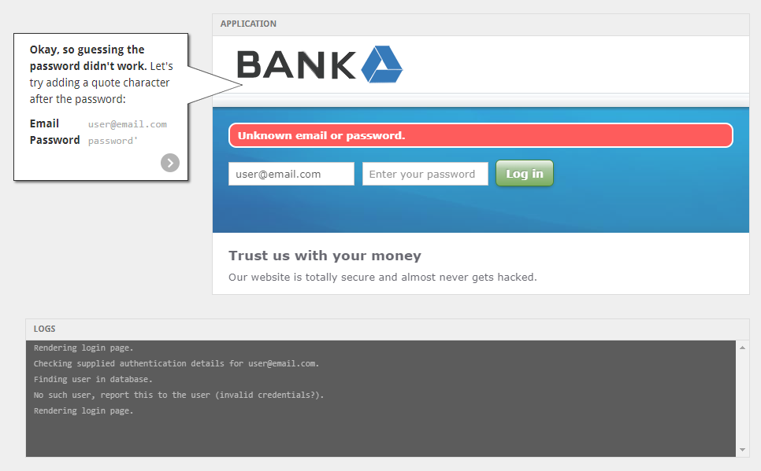
- Tuy nhiên, thử nhập email như cũ nhưng `password = password’`, server lại trả về một lỗi bất thường?
    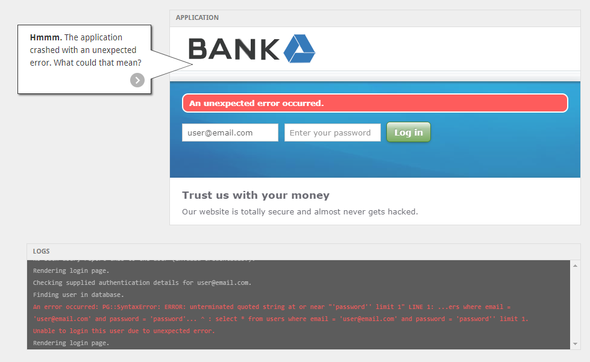
- Để ý log của server, ta thấy đó là một lỗi về cú pháp của truy vấn SQL, và code truy vấn SQL có khả năng bị Hacker khai thác.
    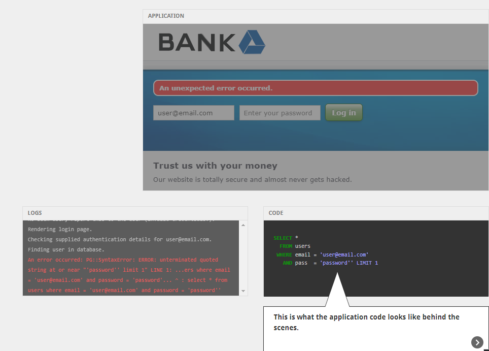
- Thử đổi password thành `' or 1=1--`, ta thấy code SQL query ở phần pass đã trở thành một mệnh đề luôn đúng `'' or 1=1` và các đoạn code sau nó đều bị comment lại.
    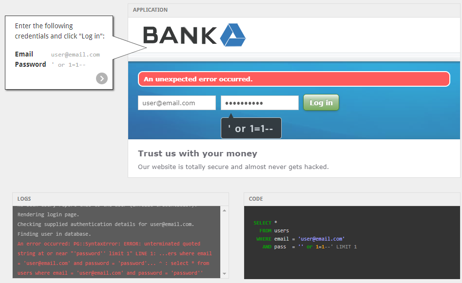
- Hacker đã đăng nhập được vào tài khoản của user mà không cần phải biết password chính xác!
    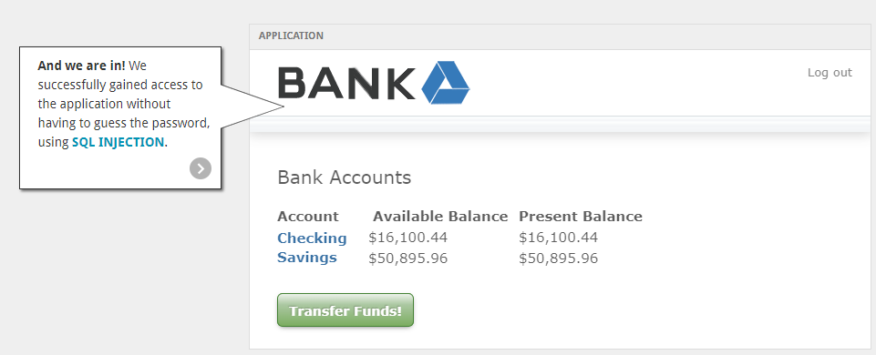

#### **_Phòng chống SQL Injection_**

- Sử dụng Parameterized Statements: không truyền trực tiếp input vào SQL để query mà để ngôn ngữ lập trình xử lý input đó trước.

    Ví dụ:

    ```javascript
    // Không an toàn
    let sql = `select * from q_users where firstname=?,${[name]}`;

    // Sử dụng thư viện mysqljs, an toàn hơn
    let sql = 'select \* from q_users where firstname=?';
    db.query(sql, [name]).then(...);
    ```

- Object Relational Mapping: ORM (Object Relational Mapping), là một kỹ thuật/cơ chế lập trình thực hiện ánh xạ CSDL sang các đối tượng trong các ngôn ngữ lập trình hướng đối tượng như Java, C# …(các table tương ứng các class, mối ràng buộc giữa các table tương ứng quan hệ giữa các class ‘has a’ , ‘is a’).
    Ví dụ: Sequelize của JS, Hibernate của Java, Dapper của C#, …
- Sanitizing Inputs: Làm sạch các input: xóa các khoản trắng thừa, kiểm tra đúng định dạng, vị trí các dấu ngoặc,…
- Third Party Authentication: Xác thực từ bên thứ 3
- Password Hashing: các thông tin nhạy cảm được hash 1 chiều trước khi lưu vào database

## Clickjacking

### **_Khái niệm Clickjacking_**

HTML có cho phép các lập trình viên có thể hiện nội dung của trang web khác bằng tag `iframe`, từ đó cho phép nội dung của các trang web có thể hoà trộn lẫn nhau nhưng vẫn có thể quản lý tốt được vì javascript từ trang web trong iframe không được chạy trong trang web mà dùng tag `iframe`.

Nhưng các hacker luôn tìm cách lợi dụng mọi thứ có lợi với họ, và `iframe` là điều không ngoại lệ. Họ có thể dùng tag `iframe` để hiện trang web của người khác trong trang web của mình, nhưng để một nút tàng hình lên trên một nút khác để lừa người dùng bấm vào, khi người dùng bấm vào thì kẻ tấn công có thể chạy javascript hoặc dẫn browser tới một website khác và thực hiện vô vàn các điều nguy hiểm. Lúc đó kẻ tấn công đã hijack (chiếm đoạt) cú click của user, hoặc có thể gọi tắt là Clickjacking.

Mấu chốt của clickjacking là ta phải để url của web chúng ta gần giống với url của web bị tấn công, để khi user có typo trong việc nhập url thì vô tình họ sẽ vào web của chúng ta mà không hề biết, vì ta đã làm web của mình giống với web bị tấn công.

### **_Phương pháp_**

Ví dụ ta muốn thực hiện tấn công một web <http://www.victim.com>, thì ta để

HTML:\
`<iframe src="http://www.victim.com/"></iframe>`

CSS:

```css
iframe {
    height: 100vh;
    width: 100vw;
    border: none;
    position: absolute;
    left: 0;
    top: 0;
}
```

Ta dùng đơn vị `vw, vh (viewport width/height)` cho `width, height` để cho `iframe` có thể chiếm 100% kích thước page, và sử dụng `position` là `absolute` để nó có thể giữ nguyên tại một toạ độ cụ thể (0, 0). Thì lúc này website của chúng ta sẽ giống y hệt web bị tấn công.

Tiếp theo là bước tạo một `button` tàng hình và để nó lên một button nào đó của trang web gốc, kích thước, các cạnh càng giống nhau càng tốt. CSS để làm button đó tàng hình có thể là như sau:

```css
color: transparent;
background-color: transparent;
```

Còn về vị trí, kích thước, thì ta có thể dùng các thuộc tính như `width, height, margin, padding, position, top, left,...` để xếp button đúng chỗ ta cần.
Sau cùng thì ta phải làm cho button đó có lợi cho chúng ta, ta có thể để một tag `anchor` bên trong nó và dẫn `href` tới một website khác của mình, hay ta có thể dùng attribute `onclick` và gọi một hàm javascript và từ đó ta có thể làm được rất nhiều thứ khác.

### **_Phòng chống Clickjacking_**

#### **Frame busting**

Frame busting là một kĩ thuật chống 1 website khỏi bị hiển thị trong 1 frame, từ đó có thể phòng chống tấn công Clickjacking. Frame busting thường được cài đặt bằng cách sử dụng javascript để luôn làm website của mình luôn là window trên cùng của bất kỳ trang web nào mà nó được hiển thị (URL luôn là của chính nó).
Ta có thể làm điều trên như sau:

```javascript
if (window.top != window.self) {
    top.location = self.location;
}
```

Tuy nhiên kẻ tấn công có nhiều cách để vô hiệu hoá kỹ thuật này, một trong những cách đó là sử dụng thuộc tính sandbox:\
`<iframe src="http://www.victim.com/" sandbox=""></iframe>`

Công dụng của thuộc tính `sandbox` đó chính là khai báo tính năng nào của website trong `iframe` nên được sử dụng, tính năng nào không, như khả năng download hay chạy script bằng cú pháp `allow-...` . Còn nếu để trống thì mọi tính năng đều bị vô hiệu hoá, trong đó có khả năng chạy script của website trong `iframe`. Xem thêm ở
<https://developer.mozilla.org/en-US/docs/Web/HTML/Element/iframe#attr-sandbox>

#### **X-Frame-Options**

Khi ta không thể chống Clickjacking từ phía frontend, ta chỉ có thể dựa vào backend - phía server để giải quyết, X-Frame-Options là một trong các cách giải quyết đó. X-Frame-Options (XFO) là một cách để nói cho browser rằng 1 trang web có nên được hiển thị bên trong một `<frame>, <iframe>, <embed>, <object>` hay không, từ đó có thể tránh được tấn công Clickjacking.

Ta chỉ có thể để XFO vào trong HTTP header, chứ không thể để trong tag meta của file HTML. Ví dụ với Apache, để phòng chống clickjacking ta để như sau:\
`Header set X-Frame-Options "DENY"`

`"DENY"` có nghĩa là trang web đó không thể được hiện trong bất kỳ frame nào, dù cho nó là của ai, ở đâu. Ngoài ra còn có options `"SAMEORIGIN"`, đó là chỉ được xuất hiện trong cùng nguồn gốc của website trong frame.

Xem thêm ở <https://developer.mozilla.org/en-US/docs/Web/HTTP/Headers/X-Frame-Options>

#### **Phòng chống Clickjacking với Content Security Policy**

Như đã có nhắc tới ở phần XSS attack, Content Security Policy (CSP) ngoài chống được XSS attack, còn có thể chống được nhiều loại tấn công khác, trong đó có Clickjacking. Để chống được Clickjacking bằng CSP, ta chỉ cần sử dụng directive `frame-ancestors`:\
`Content-Security-Policy: frame-ancestors 'none';`

`'none'` có nghĩa là không thể có frame nào chứa được website của mình, dù có là từ đâu, ở đâu. Ngoài ra ta có thể dùng `'self'`, hay một website cụ thể để chỉ có thể để trong `<iframe>` của chính website đó, hay một website mà mình tin tưởng. Nhưng điều lý tưởng là đừng nên cho ai để website của mình vào 1 frame.

Xem thêm ở <https://developer.mozilla.org/en-US/docs/Web/HTTP/Headers/Content-Security-Policy/frame-ancestors>

Về việc sử dụng X-Frame-Options hay CSP, ta phải xem xét trình duyệt:

- Chrome bỏ qua X-Frame-Options.
- Safari 9 và dưới bỏ qua CSP frame-ancestors.
- Safari 10-12 có sử dụng CSP frame-ancestors, nhưng sẽ ưu tiên X-Frame-Options nếu cả 2 cùng có sử dụng.

Lý tưởng là ta hãy xài cả hai để đảm bảo cover hết mọi trình duyệt.

## References

Web Security for Developers: Real Threats, Practical Defense\
<https://seedsecuritylabs.org/Labs_20.04/Web/>\
<https://seedsecuritylabs.org/Labs_20.04/Files/Web_CSRF_Elgg/Web_CSRF_Elgg.pdf>\
<https://portswigger.net/web-security/cross-site-scripting>\
<https://viblo.asia/p/dom-based-xss-GrLZDkXgKk0>\
<https://www.hacksplaining.com/exercises/sql-injection>\
<https://unit42.paloaltonetworks.com/network-attack-trends-february-april-2021>\
<https://developer.mozilla.org/en-US/docs/Web/HTTP/CSP>\
<https://developer.mozilla.org/en-US/docs/Web/HTTP/Headers/X-Frame-Options>\
<https://www.hacksplaining.com/prevention/xss-stored>\
<https://owasp.org/www-community/attacks/csrf>\
<https://brightsec.com/blog/csrf-attack/>\
<https://www.youtube.com/watch?v=eWEgUcHPle0>
